# Avaliação Arquitetura - Jonathan Dias Campos Santiago

## Favo de Mel
Sistema web desenvolvido para gerenciamento pedidos em comandas.
-   O sistema consiste de três perfis de acesso:
    - Administrador: `Tem acesso total ao sistema.`
    - Garçom: `Tem acesso a todas as rotinas do sistema, porem o acesso limitado. Não permitindo editar ou cadastrar um novo produto ou usuário. E contem a permissão de visualizar criar e editar comandas, não sendo possível confirmar a mesma para a cozinha.`
    - Cozinheiro: `Tem os mesmos acessos que o perfil de garçom, porem contem apenas a permissão de confirmar o pedido na cozinha.`
    
A rotina principal do sistema lista todas as comandas do dia, sendo dividido em três situações;
- Aberto, com as seguintes ações: `dependendo do perfil do usuário logado`
    - Editar;
    - Visualizar;
    - Confirmar;
- Confirmado;
    - Editar;
    - Visualizar;
    - Fechar;
- Fechado;
    - Visualizar;

O sistema contem a atualização em tempo real das comandas, caso usuário cadastre ou efetue uma ação em uma comanda já cadastrada. Atualizando assim todas as janelas com a rotina principal de comandas aberta.

## Definições de Arquitetura das Aplicações
O sistema foi arquitetado e distribuído com a estrutura em Backend e Frontend.
- Backend - Api foi desenvolvida usando as seguintes tecnologias:
    - C# .NET com ASP.NET Core 5.0;
    - Entity Framework;
    - PostgreSql;
    - JWT OAuth 2.0 para autenticação e autorização de acesso; 
    - Docker;
    - Docker Compose para orquestração dos containers do Docker;
    - RabbitMq para serviço de mensageira, na aplicação esta sendo usado para atualizar as comandas em tempo real; 
    - Redis para controle de cache;
- Frontend - Foi desenvolvida usando as seguintes tecnologias:
    - Angular 11 com Typescript;
    - RxJS para programação reativa;
    - Bootstrap;
    - NgxBootstrap;
    - Scss;
    - Docker;
    - Docker Compose para orquestração dos containers do Docker;
    - Nginx;

#### Serviços configurados em containers no Docker das aplicações:
- Api;
- Aplicação Web com Nginx;
- Banco de dados PostgreSql;
- RabbitMq;
- Health Checks;
- Flyway para executar os scripts de banco de dados default do sistema;
- Redis;

#### Definições de estrutura das aplicações:
Projeto foi desenvolvido utilizando a metodologia DDD e TDD distribuito em camadas:
- Backend
    - FavoDeMel.Api: `camada de aplicação`;
    - FavoDeMel.Domain: `camada de dominio`;
    - FavoDeMel.Repository: `camada de repositório, responsável por gerenciar todas as consultas e transações no banco de dados`;
    - FavoDeMel.Service: `camada de serviço, responsável por gerenciar todos os serviços do sistema`;
    - FavoDeMel.Tests: `camada de teste, responsável por gerenciar todos os testes unitários e de integração do sistema`;
- Frontend
    - App
        - componentes: `camada dos componentes genéricos e reutilizáveis, como cards, layout menu etc.`;
        - models: `camada das entidades tipadas da aplicação`;
        - pages: `camada dos componentes das paginas da aplicação`;
        - services: `camada de serviços e consulta na api`;
        - shared: `camada de funções e serviços compartilhado`;
    - assets
        - images
        - styles
    - enverinments
    
### Execução da aplicação:
Primeiramente deve-se clonar o projeto `git clone https://github.com/jonathandsantiago/processo-seletivo-arquitetura.git` e acessar `cd processo-seletivo-arquitetura`.

Para executar as aplicações é nescessario reservar as seguintes portas:
-  Para a Api `54300` em Https e `58080` em Http;
- `15432` para o banco de dados postgres;
- `6379` para o redis e `8081` para o redis commander;
- `15672`, `5672` e `15674` para o RabbitMq;
- `5080` para o Health Checks;
- `54200` para aplicação web executada pelo `docker-compose` ou `4200` pelo `ng s` do angular;

- Para executar ambas as aplicações simultaneamente, acesse a pasta raiz `processo-seletivo-arquitetura` execute o seguinte comando:

    - `docker-compose -f favodemel-api/docker-compose.prod.yml up -d --build && docker-compose -f favodemel-web/docker-compose.yml up -d --build`

- Para executar individualmente a Api:
    - Acesse a pasta `favodemel-api` e exucutar o seguinte comando:      
        - `docker-compose -f docker-compose.prod.yml up -d --build`
- Para executar os testes automatizado da Api:
    - Acessando a pasta `favodemel-api` e execute o seguinte comando:    
        - `dotnet test ./test/FavoDeMel.Tests`
- Para executar individualmente a aplição Web:   
    - Acesse a pasta `favodemel-web` e exucutar o seguinte comando:      
       - `docker-compose up -d --build`
        - Caso deseje executar a aplicação fora do container execute os seguintes comandos: 
            - Instale os pacotes `npm install`
            - Execute a aplicação `ng s`;

### Descrição das flags utilizada no compose
 - `up` cria e inicia os contêineres;
 - `-d` ou `--detach` irá executar os contêineres em segundo plano;
 - `--build` irá criar as imagens antes de iniciar os contêineres;
 - `-f` é opcional. Se não utilizar esta flag na linha de comando, o compose irá percorrer no diretório um arquivo `compose.yaml` ou `docker-compose.yaml`;

### Acesso aplicação após a build
- Para visualizar ou executar uma ação direta na Api pelo Swagger acesse: [Api:54300](https://localhost:54300/swagger/index.html) em Https ou [Api:58080](http://localhost:58080/swagger/index.html)
- Para acessar a aplição web acesse: 
    - [Web:54200](http://localhost:54200) Caso executado a aplicação pelo `docker-compose`
    - [Web:4200](http://localhost:4200) Caso executado a aplicação pelo `ng s`
        - Usuários:
            - Administrador:
                ```
                    Login: Admin
                    Senha: Admin
                ```
            - Garçom:
                ```
                    Login: Garçom
                    Senha: Garçom
                ```
            - Cozinheiro:
                ```
                    Login: Cozinheiro
                    Senha: Cozinheiro
- Para visualizar ou gerencias os cache da aplicação [Redis:8081](http://localhost:8081)
- Para visualizar Health Checks Status [Health Checks:5080](http://localhost:5080)
- Para acessar o RabbitMq, serviço de mensageria [RabbitMq:15672](http://localhost:15672/#/queues)
    - Usuário: `guest`
    - Senha: `guest`
- Para acessar o banco de dados PostgreSql
    ```
    server=localhost;
    port=15432;
    userid=admin;
    password=Password_1;
    database=favodemel
    ```    

## Definições técnicas e padrões dos sistemas
### Definições técnicas
- O `Program.cs` utiliza a extensão `MigrateDbContext<FavoDeMelDbContext>()` localizada no projeto `FavoDeMel.Repository.Extensions` recebendo o tipo do DbContext.
    Esta ação irá execultar os `Migrations` ao rodar a build.
    Caso contenha mais de um DbContext basta reclipar a extensão passando o tipo desejado.

    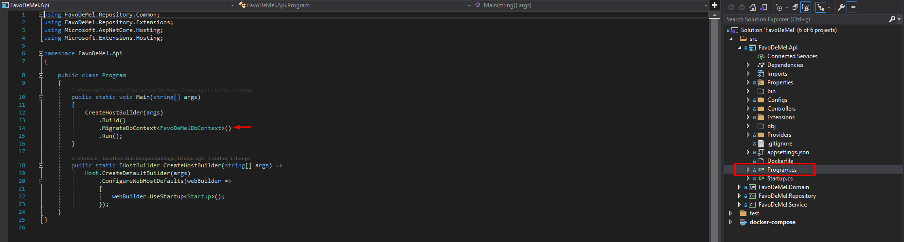

- Para configurar as injeções de dependências no `Startup` da aplicação. Foi desenvolvido a extensão `.AddApiProvidersAssembly` recebendo o `Microsoft.Extensions.Configuration.IConfiguration` como parâmetro.
Esta extensão irá injetar todos os providers criados na pasta `FavoDeMel.Api.Providers` assinado com a interface `IApiProvider`.
    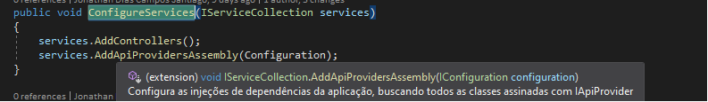

    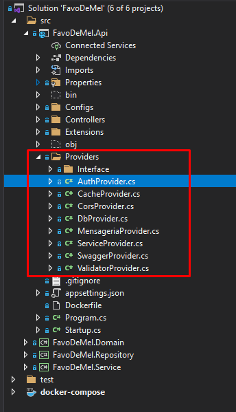

    A interface `IApiProvider` contem o método void `void AddProvider(IServiceCollection services, ISettings<string, object> settings)`:

    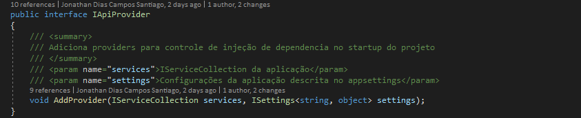

    Este método adiciona todas as injeções de dependência da aplicação. O método espera em parâmetro o `Microsoft.Extensions.DependencyInjection.IServiceCollection` e o `FavoDeMel.Domain.Interfaces.ISettings<TKey, TValue>`.
    
    O `settings` contem todas as chaves e valores dos objetos assinado com a interface `ISettings` esses objetos estão localizados em `FavoDeMel.Domain.Models.Settings`

    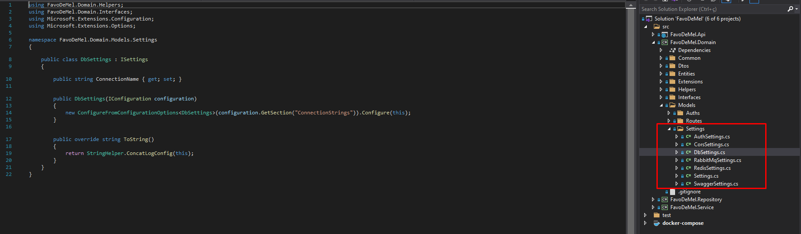

    Os valores serão atribuidos ao objeto conforme as configurações no `appsettings`:

    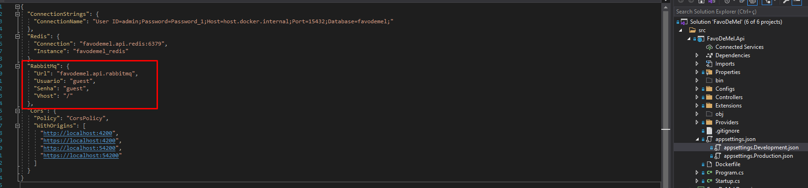

    Construindo o objeto com `Microsoft.Extensions.Options.ConfigureFromConfigurationOptions<TOptions>` passando o nome do objeto no `configuration.GetSection()` no exemplo abaixo estou atribuindo os valores do `RabbitMq` do `appsettings` para o objeto `RabbitMqSettings`:

    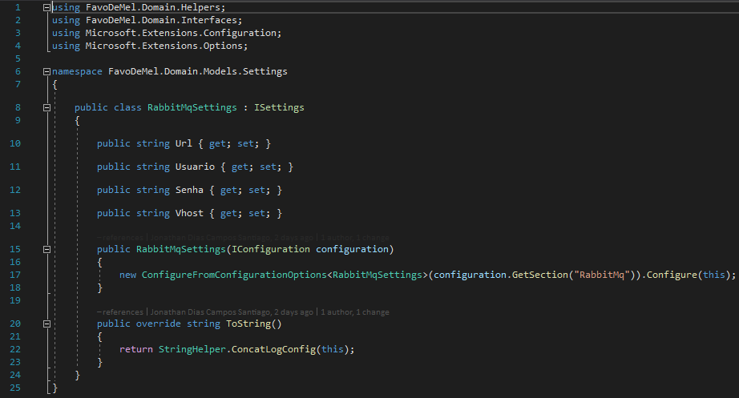
    
    Todos os demais `Settings` deverá seguir o mesmo padrão.

    Os `Settings` faz override em `ToString()` retornando `StringHelper.ConcatLogConfig(this)`, está ação irá printar no log ao levantar a aplicação os valores atribuídos em cada `Settings`:
    
    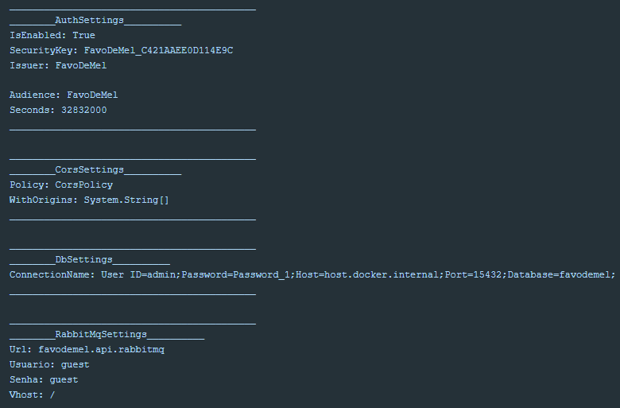

- O mesmo procedimento é aplicado no `Configure` do `Startup`, utilizando a extensão `.AddApiConfigsAssembly(env, Configuration)`. Espera como parâmetro o `Microsoft.AspNetCore.Builder.IApplicationBuilder` e `Microsoft.AspNetCore.Hosting.IWebHostEnvironment` e irá adicionar todas as configurações localizadas na pasta `FavoDeMel.Api.Configs` assinado com a interface `IApiConfigure`.

    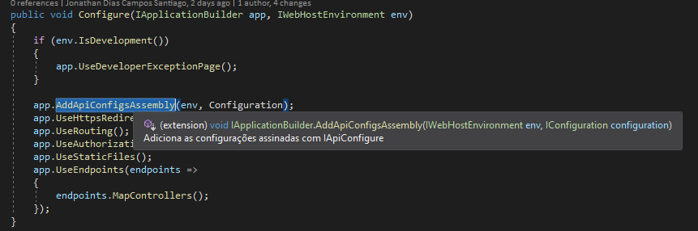

    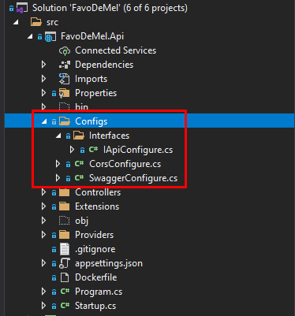
 
    A interface `IApiConfigure` recebe como parâmetro o `IApplicationBuilder`, `IWebHostEnvironment` e `ISettings<string, object>` o settings é o mesmo informado a cima na interface `IApiProvider`.

    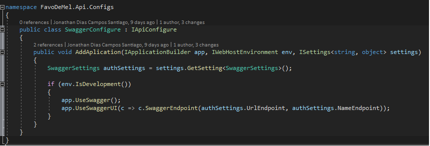

- O provider de mensageria utilizando o `RabbitMq` criando na inicialização os `Endpoint` de recebimento de todos os commands assinado `FavoDeMel.Domain.Interfaces.IMensageriaCommand`. Esta ação irá criar para cada `Command` um `Exchanges` do tipo `fanout` no `RabbitMq`:

    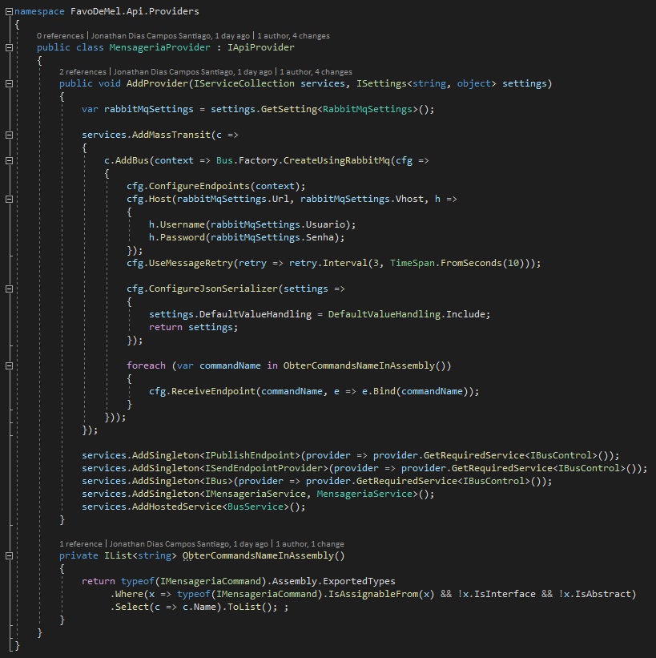

    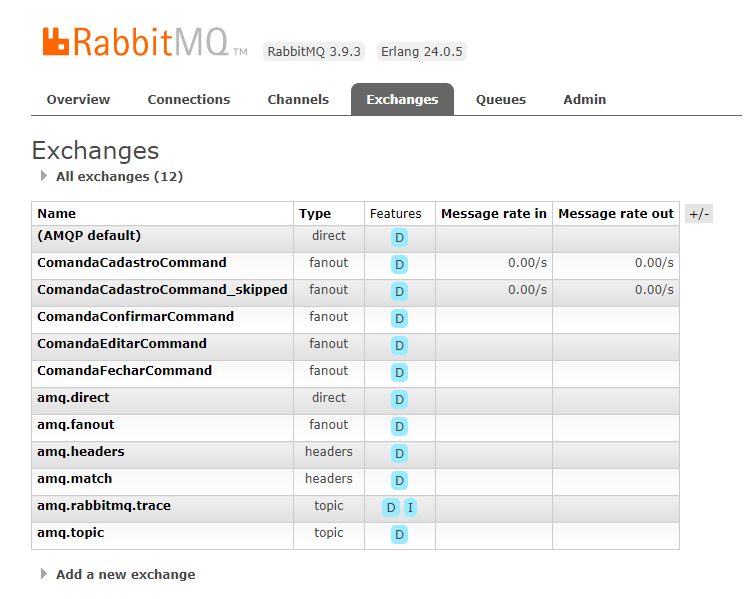

    Esta ação é necessária para configurar no frontend os serviços de `consumer` webstomp, a atualização em tempo real de cada ação. Caso não aplicado esta configuração, o frontend só vai conseguir se comunicar de forma correta com o rabbitmq após o envio de uma mensagem na fila de cada `Command`, que por sua vês o envio na fila cria o `Exchanges` do tipo `fanout`.

    Outra configuração importante para funcionamento da comunicação do fronted com o rabbitmq é no compose. No compose o serviço `favodemel.api.rabbitmq` copia para o volume `/etc/rabbitmq/enabled_plugins` o enabled_plugins localizada na pasta `config` da raiz `favodemel-api`. O arquivo enabled_plugins contem a seguinte configuração `[rabbitmq_management, rabbitmq_web_stomp].` esta ação irá habilitar o `rabbitmq_web_stomp` que por sua vês habilita o uso do STOMP em um contexto de navegador web.
    
### Padrões
 - No projeto `FavoDeMel.Api` na pasta `Controllers` contem a pasta `Common` onde se localiza todos as controller base e na raiz contem apenas as `Controller` da aplicação.
    As controllers com nescessidade de acesso registro utiliza `[Authorize(JwtBearerDefaults.AuthenticationScheme)]` e as rotas deverá ser criada na classe `FavoDeMel.Domain.Models.Routes.Endpoints`.

    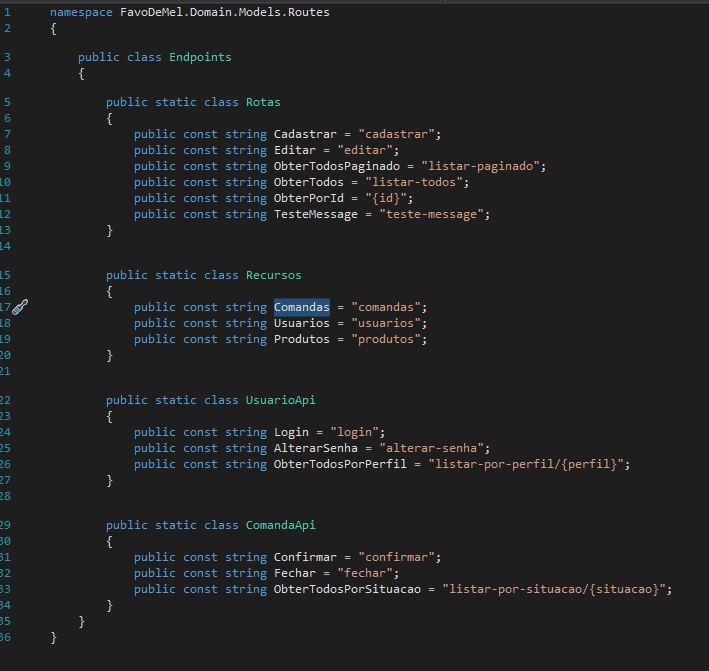

    A classe estática `Recursos` é para definição de nome de cada controller e a classe estática `Rotas` são as nomenclatura das rotas genéricas "Que vai ser a nomenclatura padrão", caso deseje uma nomenclatura específica de um endpoint de uma controller. 
    Deve-se criar a classe estática com o nome da controller api ex: `ComandaApi` e dentro dela a nomenclatura de cada endpoint especifico.
    Este modelo é utilizado para centralizar as rotas da api e mantendo um padrão de nomenclatura seguindo em base das já existentes.

    As controllers não deverão ter regras de negócio e nem consulta direta em banco de dados.
    Esta ações deverá ser distribuída em serviços, validadores e repositórios.

- No projeto `FavoDeMel.Domain` contem as pastas:
    - `Common` onde contem todas as classes base ou comum
    - `Dtos` onde contem todos os Dtos que serão expostos na api, os `Filtros` e `Mappers`.
        - `Mappers` centraliza todas configurações de mapeamento da entidade com o dto e vice-versa.
    - `Entities` onde contem todas as entidades mapeada no banco de dados. Cada entidade contem sua pasta com a nomenclatura no plural. Ex: `Comandas`:

        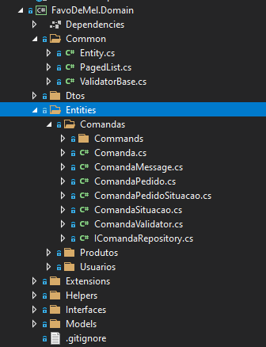

        Nela encontra-se os `Commands` do serviço de mensageria, o validator e a interface de repositório da entidade.

- Para centralizar um ponto de validações nos dto vindo da requisição na api e validações de banco de dados foi desenvolvido `Validator`. Cada entidade poderá ou não conter o validator, porem caso o endpoint nescessite de validação no serviço, esta validação deverá estar em um validator. Isso é necessário para que haja um padrão de centralização de validações.

    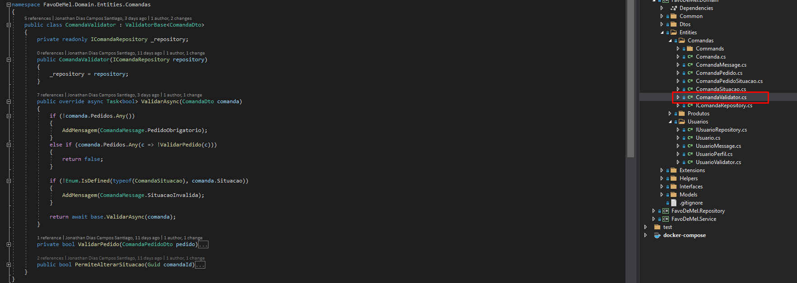

- No Frontend cada pagina deverá conter seu `module` e o `rouing.module`, no `app-routing.module.ts` a navegação de cada rota faz o lazy loading dos modulos, carregando assim somente os modulos usado em cada pagina.

    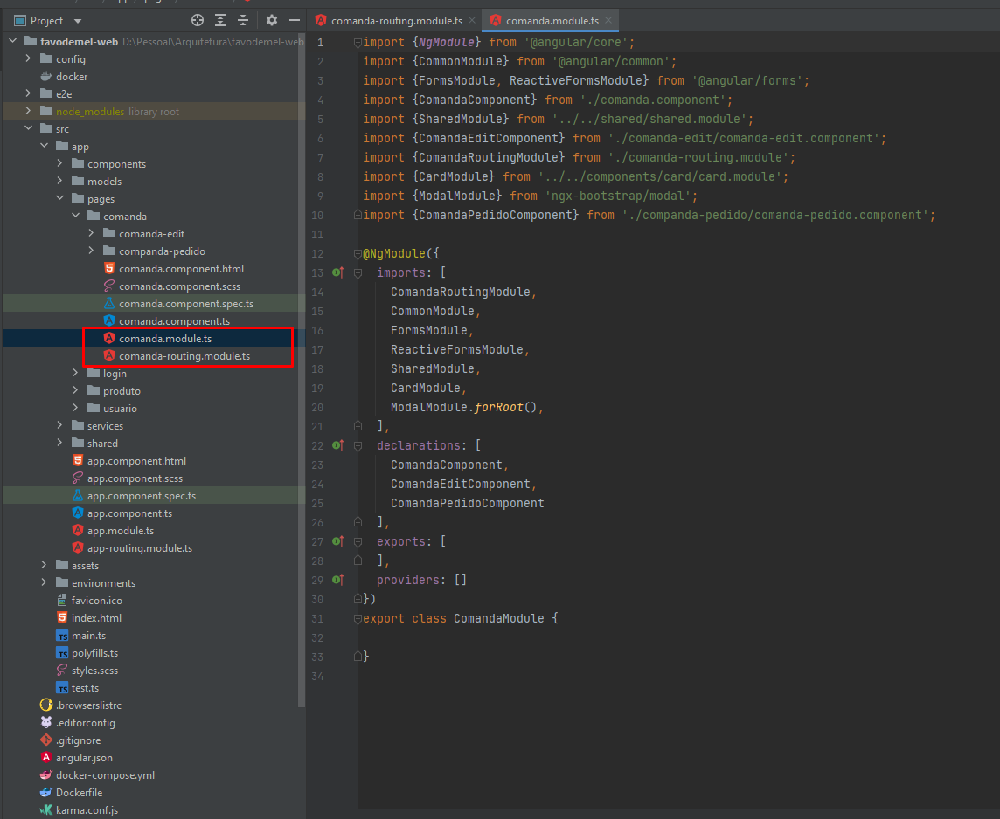
    
     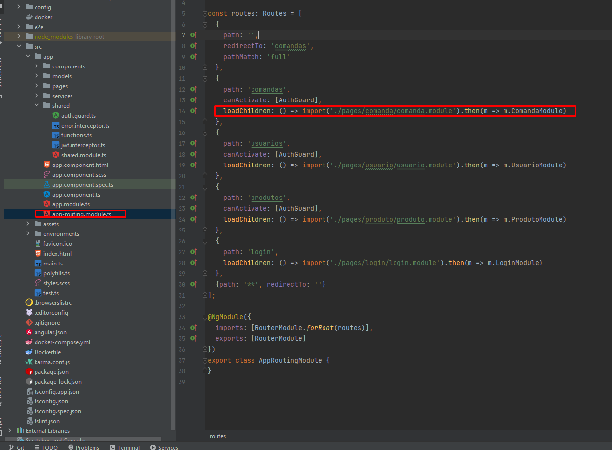

- Caso necessite de diretivas e pipes os mesmos deverá ser criados em suas pastas no `shared`, no projeto não contem as pastas por não aver a necessidade no primeiro momento.

    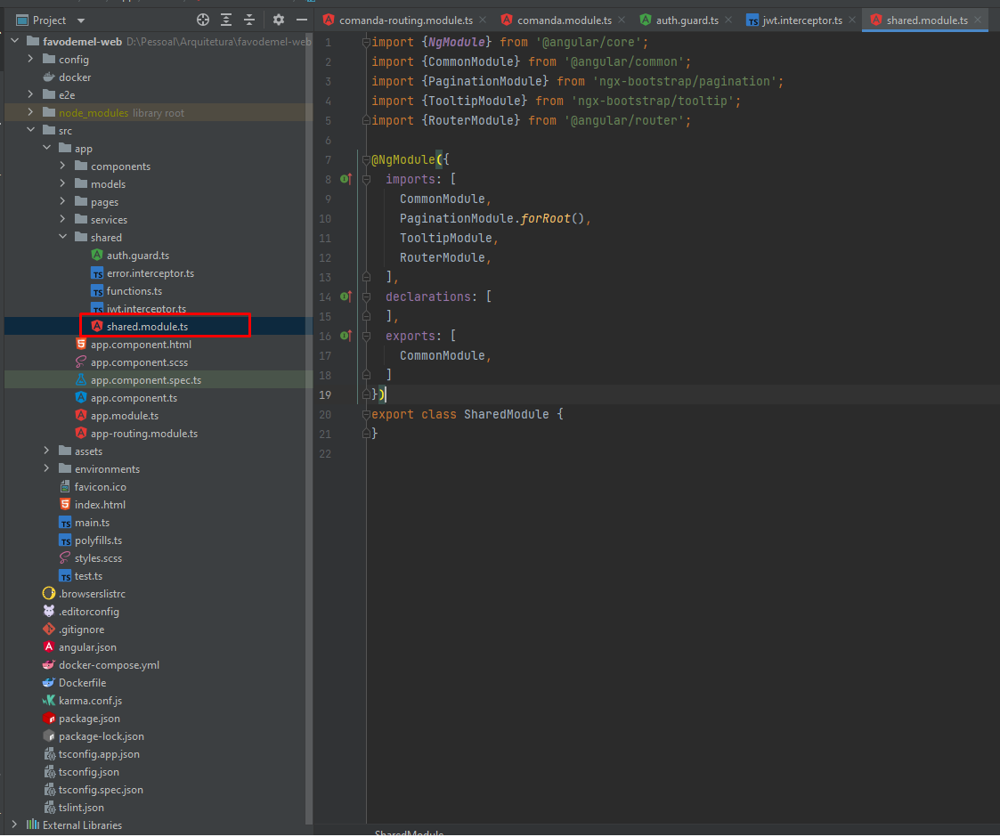

- Os arquivos de auto guard e interceptors também estão localizados nas pastas shared.

- Os componentes de layout, genéricos e reutilizaveis, estão localizados em components. Estes componentes dependendo da situação também é valido os mesmo conter seus respectivos modulo.

    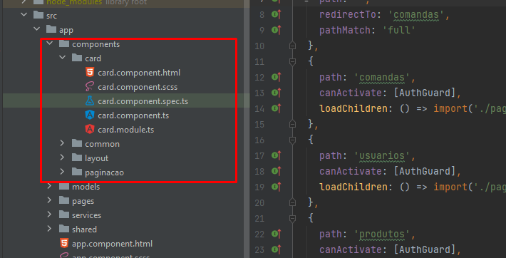

- Os `Consumers` de mensageria estão localizados em seus respectivos serviços, ex: os consumers de comanda estão localizados no serviço de comanda. Esses consumers estão "assistindo" o `exchange` de cada endpoint. 
Como cada exchange esta configurado com tipo `fanout` isso irá replicar a mensagem para todos que estão assintindo o exchange, diferente da `queue` que ao receber a mensagem a mesma sai da fila.

    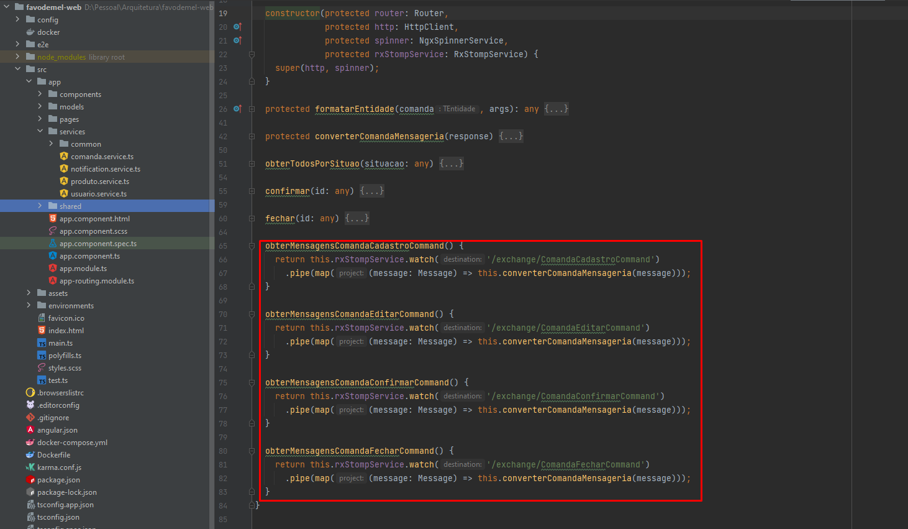

### Definições do sistema
- O uso do `RabbitMq` na aplicação esta na atualização em tempo real das comandas, atualizando assim todas as janelas que estejam abertas na tela inicial:

    

- Para garantir a integridade dos serviços esta sendo utilizado o `Health Checks Status`. Como cada serviço é essencial para funcionamento correto da aplicação, todos eles estão utilizando a tag `essential`:

    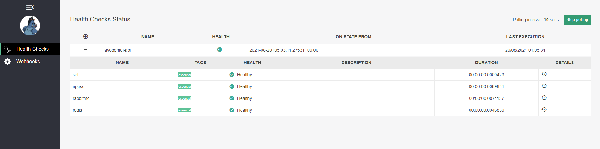
    
### Problemas conhecidos na execução da aplicação pelo Docker
- Caso ao executar a aplicação e haja conflitos nas portas, removas os containers `docker container prune --force` certifique que não contenha nenhum outro container usando a porta `docker container ls`, caso o container não foi removido por estar em execução execute `docker stop id_do_container` e execute novamente `docker container prune --force`.
- Remova os `docker network prune --force`
- Em alguns casos limpe os volumes `docker system prune --volumes`
